

  

# Project Abstract
This website describes the design of a very confusing clock. Similar to traditional wall clocks, it has twelve numbers arranged around a panel, as well as minute and hour hands. However, the numbers 1 - 12 around the panel are randomized every hour, and the clock hands will always point to the correct numbers to tell the current time. The logic circuit behind this clock is realized with an MCU and FPGA pair. See the Project Motivation section for details. 

# Project Motivation
The east dorm has a tradition to collect clocks of all sizes and types. We would like to add to their clock collection with a new fancy clock, where the numbers 1-12 on the clock are randomized in position every hour. For example, a regular clock always displays 12, 1, 2, 3…10, 11 starting at the top. Instead, we build a clock that randomizes each digit’s placement every hour. In the first hour, the digit might be 5,6,8,4… starting at the top, and next hour, this sequence will become randomized to maybe 11, 2, 4, 9…. Other than this, we include a minute and hour hand to the clock (controlled by servos), and they have to always point to the correct numbers representing the current time. For example, if the current time is 4:25, the hour hand and minute hand must point to 4 and 5, regardless of where these digits are. (See Figures 1 below for a demonstration). 
***
Fig. 1 Random Clock Demo

  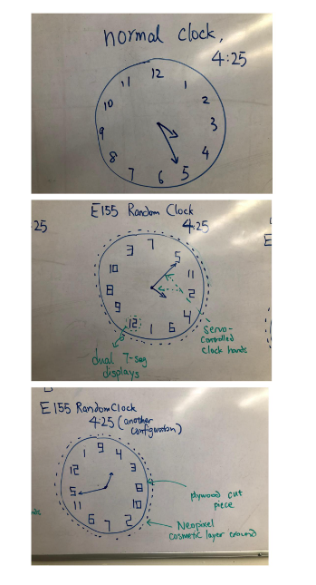

# What we Have and Have not Accomplished
As of the project due date (12/8/22) we have successfully achieve the following goals vital to our project:
  1. Generated random clock number positions in the MCU using the onboard TRNG peripheral. 
  2. Sent these clock positions to the FPGA over SPI for decoding. 
  3. Decoded the clock positions on the FPGA and displayed them on 12 dual seven-segment displays arranged in a circle on a breadboard. 
  4. Interfaced with a Neopixel Strip using the FPGA, so that it cycles through the colors of a rainbow. 
  5. Interfaced with two servos that point to specific locations over time, based on the random clock positions generated. 
  6. Built servo gearboxes and laser cut clock panels needed for the final assembly.
 
What we have yet to finish: 
  1. Fine tune the servo parameters so that they always accurately point to the correct clock positions. 
  2. Assemble the breadboard circuit, the clock panel and the servo gearboxes into a compact, cohesive final product. 
  3. Adjust the brightness of the neopixel so that it is less disruptive to people trying to tell time on the clock. 
 
# Major Components Used
<!-- The bill of materials should include all the parts used in your project along with the prices and links.  -->

| Item | Part Number | Quantity | Unit Price | Link |
| ---- | ----------- | ----- | ---- | ---- |
| dual seven-segment displays |  LTD6410AG | 12 | stockroom | https://www.digikey.com/en/products/detail/liteon/LTD-6410G/3199123 |
| PNP transistor | 2N3906 | 24 | stockroom |https://www.digikey.com/en/products/detail/stmicroelectronics/2N3906/603429?utm_adgroup=STMicroelectronics&utm_source=google&utm_medium=cpc&utm_campaign=Dynamic%20Search_EN_Focus%20Suppliers&utm_term=&utm_content=STMicroelectronics&gclid=CjwKCAiAs8acBhA1EiwAgRFdw12wrYv2MVxmmVXYWDWyvkeNP7gP64nfoixennjbvF99BNkyktPERBoCLjsQAvD_BwE |
| 3 to 8 decoders | DM74LS139 | 3 | stockroom | https://www.digikey.com/en/products/detail/onsemi/DM74LS139N/3301 |
| microservos | SG90 | 2 | stockroom | https://www.digikey.com/en/products/detail/gearbox-labs/PART-MICRO-SERVO-SG-90-ANALOG/16159912?utm_adgroup=Battery%20Products&utm_source=google&utm_medium=cpc&utm_campaign=Dynamic%20Search_EN_Product&utm_term=&utm_content=Battery%20Products&gclid=CjwKCAiAs8acBhA1EiwAgRFdwwgGRt2WqlFrkcezkk1UxbvZydEK6MfRLG4xHJhkBX_pS5LJn3NbQhoCLuUQAvD_BwE |
| neopixel strip | WS2812 | 1 | self-owned | https://www.aliexpress.us/item/2251801850504415.html?gatewayAdapt=glo2usa4itemAdapt&_randl_shipto=US | 
| FPGA and MCU | iCE405K,STML432KC | 1,1 | given | | 

**Total cost: $0**

# Gallery

  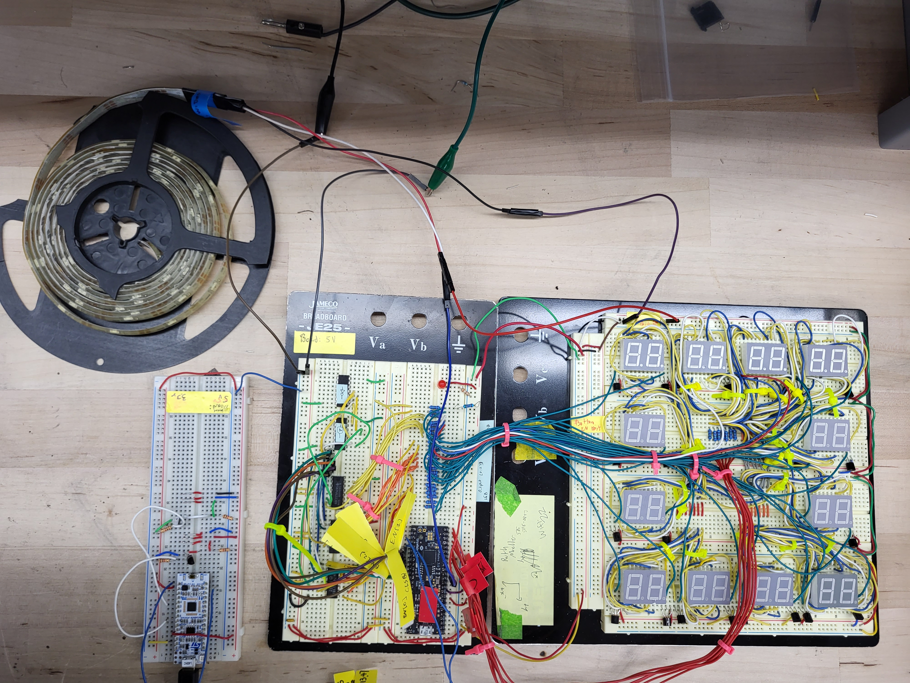

  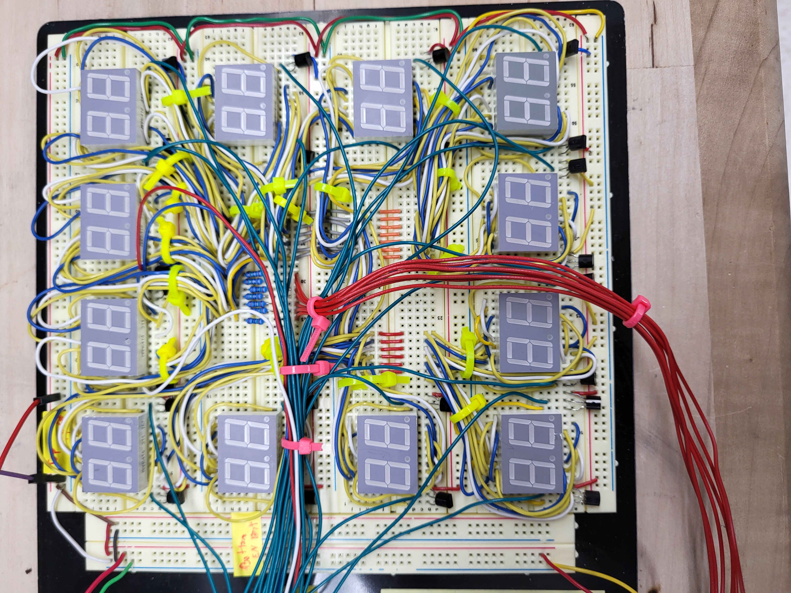

  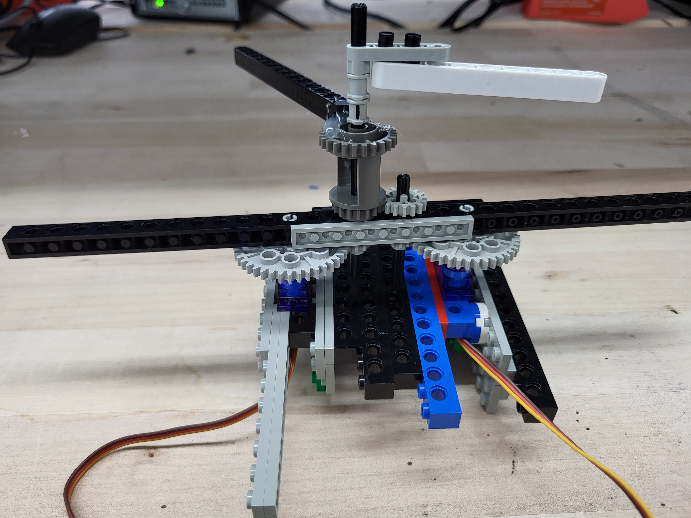

  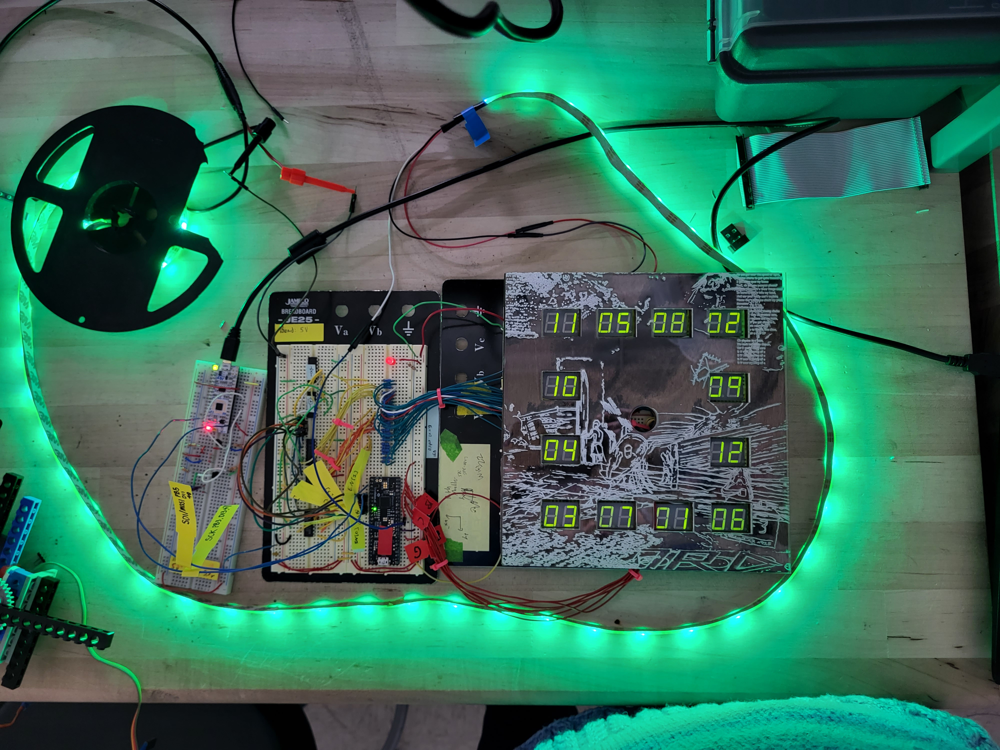

  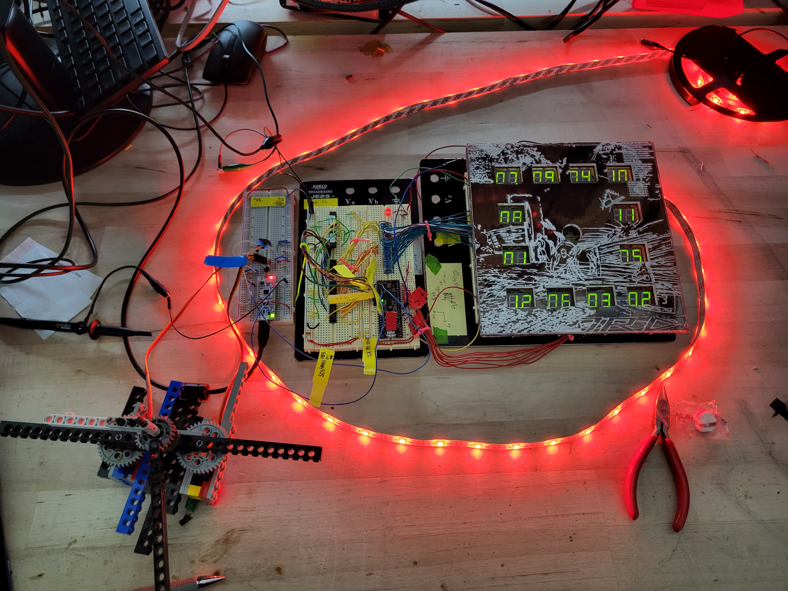

  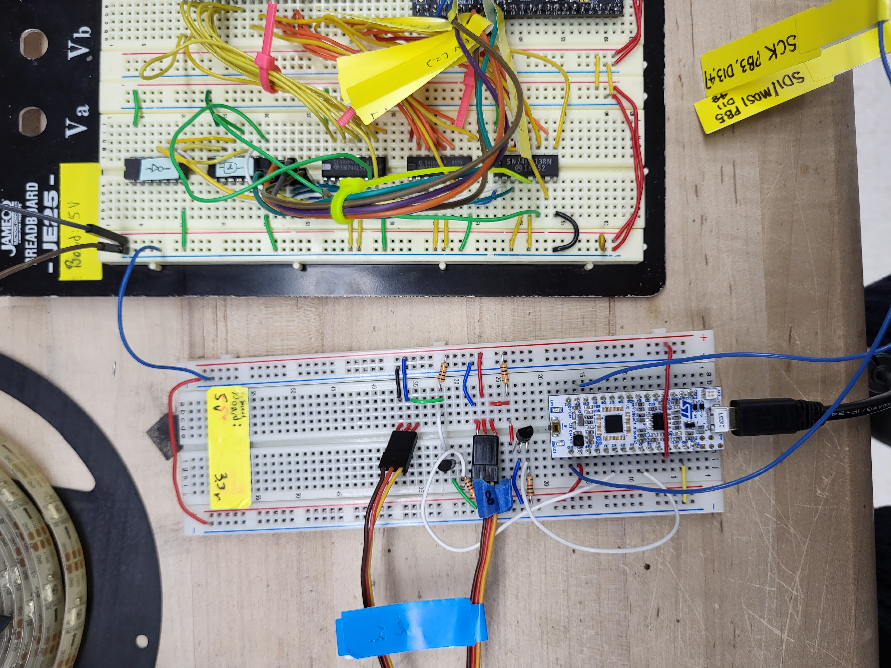

  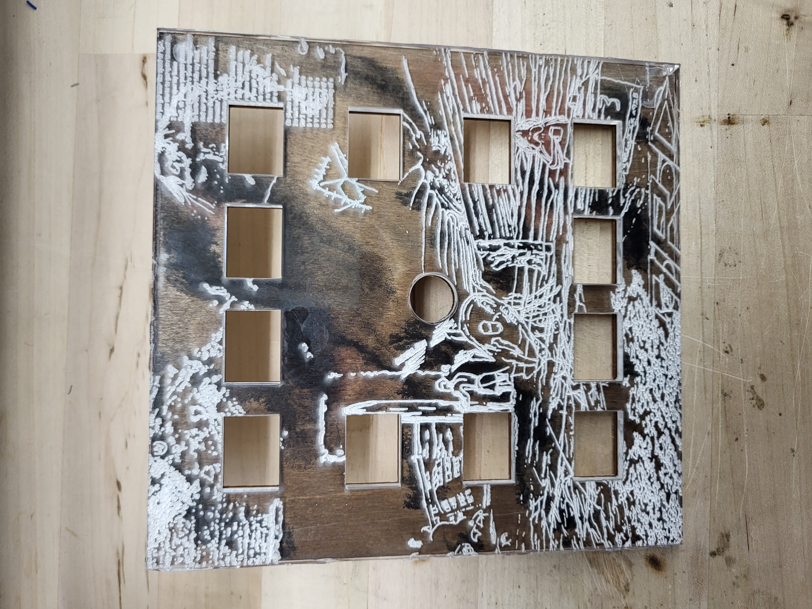

  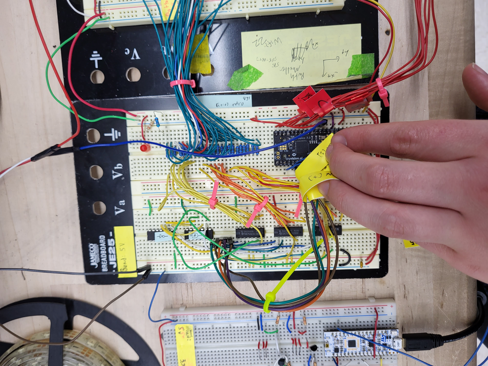

  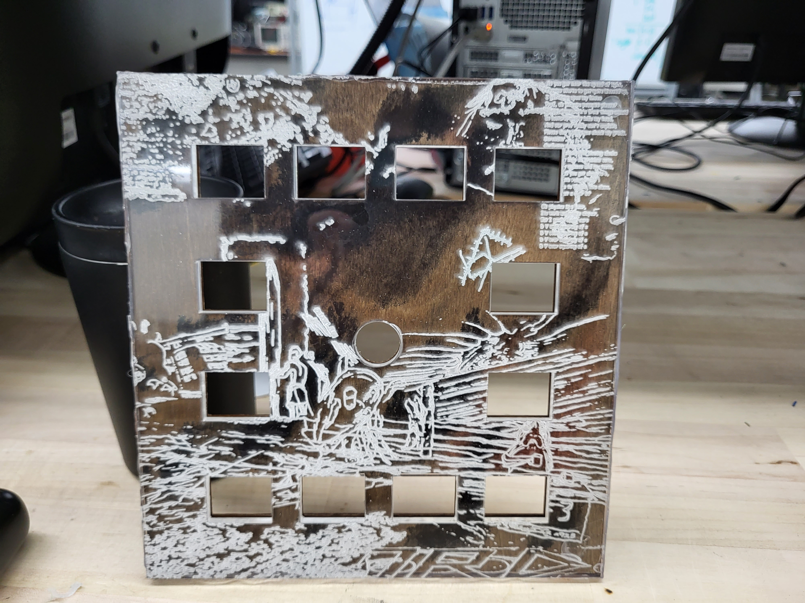

  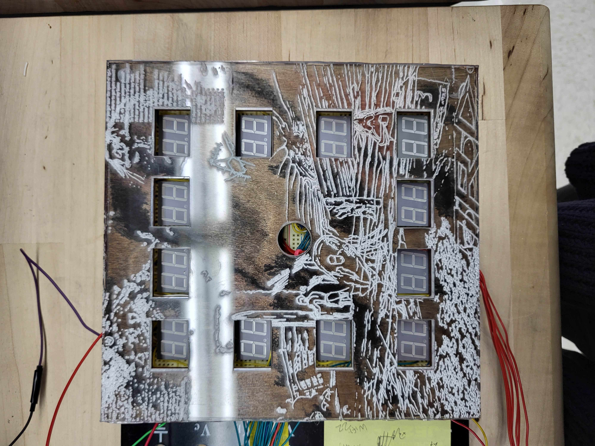

  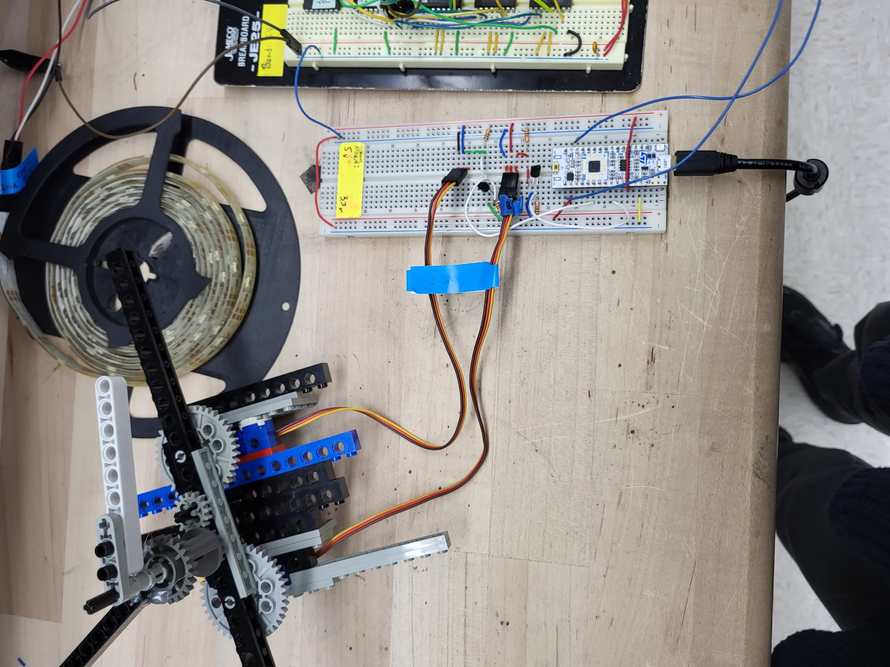

  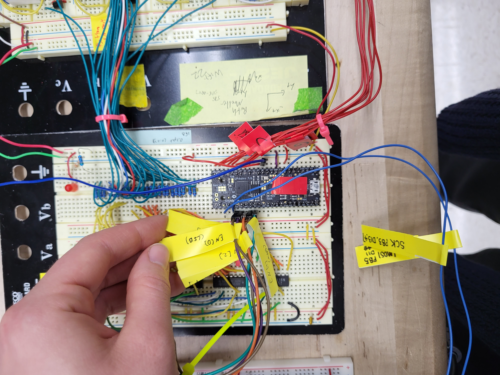

  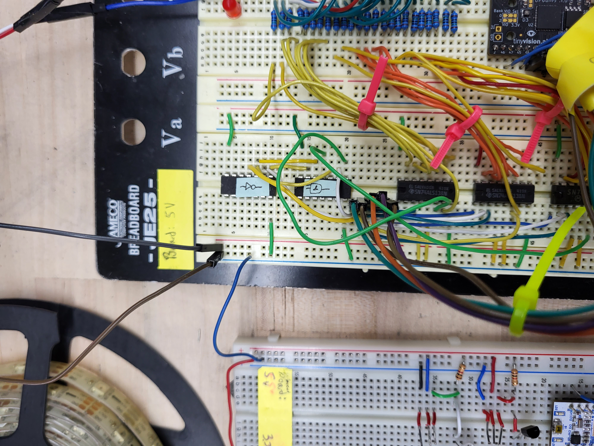

# Source Code Overview

The source code for the project is located in the Github repository [here](https://github.com/koooo-142857/E155_Random_Clock/tree/main/src).

